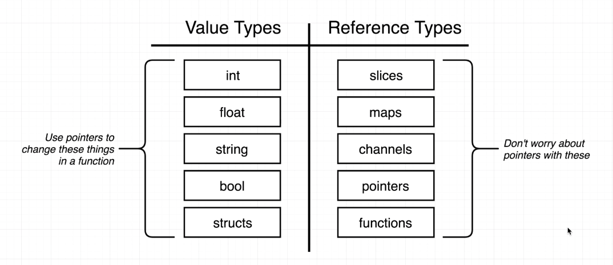
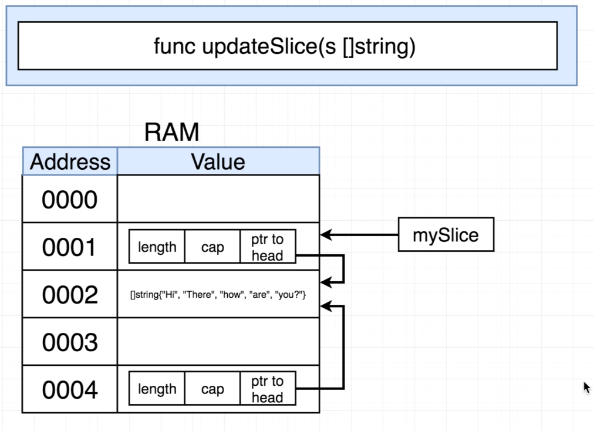

# Go: The Complete Developer's Guide (Golang) Course Content

Url: https://www.udemy.com/course/go-the-complete-developers-guide

## Important Diagrams

When you create a slice you are creating two data structures: an array with the actual values and a slice with information(array length, capacity and pointer to array head) to access the array. When you pass the slice to a function it will only create a copy of the slice, but this new slice will be pointed to the original array of values.